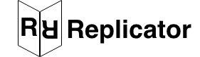
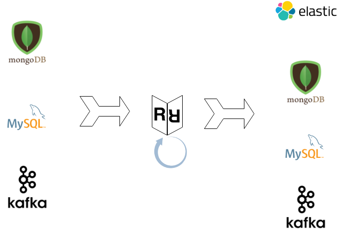

# Replicator
[](https://goreportcard.com/report/github.com/cohenjo/replicator)
[](https://godoc.org/github.com/cohenjo/replicator)



## General
Replicator is a go package that replicates data between multiple data sources using change streams.
It can replicate data between any sources, including MySQL, MongoDB, Kafka, Elastic and others in the future.

Replicator uses MySQL [replication](https://github.com/siddontang/go-mysql#replication) to read a MySQL change stream as a replica. (including AWS RDS)  
Mongo includes [Change Streams](https://docs.mongodb.com/manual/changeStreams/#change-streams), so this is a cinch.
For Kafka, Replicator uses [sarama](https://github.com/Shopify/sarama). Kafka doesn't really have a change stream, but we use it as a bus to distribute change events across data centres. 
PG uses binary logs (WALS) to transfer replication, so that's technically feasible, but not yet implemented.  
AWS DynamoDB provides change stream API and official [AWS-SDK-go](https://github.com/aws/aws-sdk-go) and even [example code](https://github.com/aws/aws-sdk-go/blob/master/service/dynamodbstreams/examples_test.go)  


Once Replicator receives an event for a record change, such as insert, update, delete, we transform it using [kazaam](https://github.com/qntfy/kazaam) and propagate the change to the registered database endpoints.
We support field mapping, field filtering, and transformations. For example, you can change column names or field names during replication.

Metrics on input/output records are exposed using Prometheus.

## General Flow



## Getting started

Generate a configuration file containing input streams, output estuaries, and the transformations you want to perform on the records.
You can define multiple input/output paths.
Note: transformations are done using kazaam, so features and limitations are those of kazaam.
```
go get -u github.com/cohenjo/replicator
```

The schema must exist before you start the replicator. Also, Replicator does not replicate schema change events.

you should have a unique ID named `id` 


## Performance Status

Current implemenatation is rather "local" in design - it reads from the source streams, transforms and writes to endpoints.
If the deployment has remote endpoints it might be better to use a replicated kafka topic with [snappy](https://github.com/golang/snappy) or similar algorithem.


## Features

 - [x] MySQL - input/output
 - [x] MongoDB - input/output
 - [x] KAFKA - input/output
 - [x] ElasticSearch - output
 - [x] Metrics - expose metric of to prometheus
 - [ ] Support of all CRUD ops
 - [ ] Grafana Dashboard - extend dashboard
 - [ ] Load tool 
 - [ ] Demo with all functionality

## Alternatives

[gollum](https://github.com/trivago/gollum) - very robust system but lacking DB suport.  
[debezium](https://debezium.io) - currently more around trditional db systems (MySQL, Oracle, SQL Server, MongoDB and PostgreSQL)


## built using
- [go-mysql](https://github.com/siddontang/go-mysql)
- [sqlx](https://github.com/jmoiron/sqlx)
- [mongo go driver](https://github.com/mongodb/mongo-go-driver)
- [kazaam](https://github.com/qntfy/kazaam)
- [ffjson](https://github.com/pquerna/ffjson)
- [sarama](https://github.com/Shopify/sarama)
- [elasticsearch go driver](github.com/elastic/go-elasticsearch)
- [prometheus client](https://github.com/prometheus/client_golang/)

## License
`reflector` is licensed under MIT License. 
Some of the components used are Licensed under Apache License, Version 2.0
Please review before using in commercial environments.
