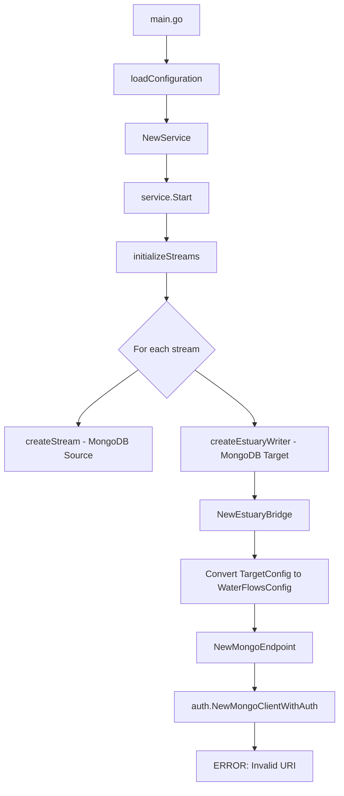

# Replicator Initialization Flow Analysis

## Root Cause: MongoDB Connection URI Parsing Error

### Error Message
```
{"level":"error","error":"error parsing uri: invalid host \"\": port must be in the range [1, 65535]","time":"2025-09-17T16:38:32Z","message":"connection failure"}
```

### Problem Analysis

The error occurs during MongoDB target initialization in the EstuaryWriter creation process. Here's the detailed flow:

## Initialization Flow



## Root Cause

**Location**: `pkg/estuary/mongo.go` in `NewMongoEndpoint()` function

**Problem**: When URI is not provided in the legacy config, it tries to build a connection string using:

```go
authConfig.ConnectionURI = fmt.Sprintf("mongodb://%s:%s@%s:%d/admin", 
    config.Global.DBUser,     // <- These are NIL/empty
    config.Global.DBPasswd,   // <- These are NIL/empty  
    streamConfig.Host, 
    streamConfig.Port)
```

**Issues**:
1. `config.Global` might be nil
2. `config.Global.DBUser` and `config.Global.DBPasswd` don't exist in the new config structure
3. This results in an empty host/username causing the MongoDB driver to fail with "invalid host" error

## Configuration Mapping Issue

**Current Configuration (YAML)**:
```yaml
target:
  type: "mongodb"
  uri: mongodb+srv://orchestration-stg-weu-vcore-tenant-store.global.mongocluster.cosmos.azure.com/
  database: "cpanel"
  options:
    collection: "replicated"
    auth_method: "entra"
    scopes:
      - "https://ossrdbms-aad.database.windows.net/.default"
    refresh_before_expiry: "5m"
```

**EstuaryBridge correctly maps**:
```go
legacyConfig.MongoURI = targetConfig.URI  // ✅ This works
```

**But MongoEndpoint fails**:
```go
if streamConfig.MongoURI != "" {
    authConfig.ConnectionURI = streamConfig.MongoURI  // ✅ This should work
} else {
    // ❌ This fallback fails due to missing global config
    authConfig.ConnectionURI = fmt.Sprintf("mongodb://%s:%s@%s:%d/admin", 
        config.Global.DBUser,    // NIL
        config.Global.DBPasswd,  // NIL
        streamConfig.Host, 
        streamConfig.Port)
}
```

## Solution Required

1. **Fix MongoDB endpoint initialization** to properly handle:
   - URI-based connections (priority)
   - Pass through authentication method and parameters
   - Properly handle URI vs host/port scenarios
   - Map target options to legacy config fields

3. **Fixed NewMongoEndpoint** (`pkg/estuary/mongo.go`):
   - Use authentication method from config instead of hardcoded value
   - Set Entra authentication parameters when auth method is "entra"
   - Parse duration strings correctly

## Flow Diagram

```
┌─────────────────┐
│   main.go       │
│   - Load config │
│   - Start app   │
└─────────┬───────┘
          │
          ▼
┌─────────────────┐
│ replicator/     │
│ service.go      │
│ - NewService()  │
│ - Start()       │
└─────────┬───────┘
          │
          ▼
┌─────────────────┐     ┌─────────────────┐
│ initializeStreams│────▶│ initializeTargets│
│ - MongoDB stream │     │ - EstuaryWriter  │
│ - Source setup   │     │ - Target setup   │
└─────────────────┘     └─────────┬───────┘
                                  │
                                  ▼
                        ┌─────────────────┐
                        │ CreateEstuary   │
                        │ Writer()        │
                        └─────────┬───────┘
                                  │
                                  ▼
                        ┌─────────────────┐
                        │ NewEstuary      │
                        │ Bridge()        │
                        └─────────┬───────┘
                                  │
                                  ▼
                        ┌─────────────────┐
                        │ NewMongo        │
                        │ Endpoint()      │
                        └─────────┬───────┘
                                  │
                                  ▼
                        ┌─────────────────┐
                        │ auth.NewMongo   │
                        │ ClientWithAuth()│
                        └─────────────────┘
```

## Configuration Flow

### Input Configuration (YAML)
```yaml
target:
  type: "mongodb"
  uri: "mongodb+srv://host.com/"
  database: "cpanel"
  options:
    collection: "replicated"
    auth_method: "entra"
    scopes:
      - "https://ossrdbms-aad.database.windows.net/.default"
```

### Conversion Process
```
TargetConfig → WaterFlowsConfig → MongoAuthConfig
     │               │                    │
     │               │                    ▼
     │               │         ┌─────────────────┐
     │               │         │ - ConnectionURI │
     │               │         │ - AuthMethod    │
     │               │         │ - TenantID      │
     │               │         │ - ClientID      │
     │               │         │ - Scopes        │
     │               │         └─────────────────┘
     │               │
     │               ▼
     │    ┌─────────────────┐
     │    │ - MongoURI      │
     │    │ - MongoAuth     │
     │    │   Method        │
     │    │ - MongoTenantID │
     │    │ - MongoClientID │
     │    │ - MongoScopes   │
     │    └─────────────────┘
     │
     ▼
┌─────────────────┐
│ - Type          │
│ - URI           │
│ - Database      │
│ - Options       │
│   - auth_method │
│   - scopes      │
└─────────────────┘
```

## Key Components

### 1. Stream Source Creation
- **Location**: `pkg/replicator/service.go` → `createStream()`
- **Purpose**: Creates MongoDB change stream listeners
- **Works correctly**: Uses shared `auth.NewMongoClientWithAuth()`

### 2. Target Writer Creation  
- **Location**: `pkg/replicator/service.go` → `CreateEstuaryWriter()`
- **Purpose**: Creates target database writers
- **Fixed issue**: Now properly handles URI and Entra authentication

### 3. Authentication Integration
- **Location**: `pkg/auth/mongo_client.go`
- **Purpose**: Unified MongoDB authentication (connection string + Entra)
- **Works correctly**: Handles both auth methods seamlessly

## Recommendations

### 1. Immediate Actions ✅ COMPLETED
- [x] Add MongoDB auth fields to WaterFlowsConfig
- [x] Update EstuaryBridge to pass through auth configuration  
- [x] Fix NewMongoEndpoint to use dynamic auth method
- [x] Test with the provided Helm configuration

### 2. Future Improvements

1. **Deprecate Legacy WaterFlowsConfig**:
   - Create native EstuaryWriter implementations that use TargetConfig directly
   - Remove the legacy config conversion layer

2. **Enhanced Error Handling**:
   - Add validation for URI vs host/port combinations
   - Provide clearer error messages for configuration issues

3. **Configuration Validation**:
   - Add validation to ensure required auth fields are present
   - Validate URI format and scope configurations

4. **Testing**:
   - Add unit tests for EstuaryBridge conversion logic
   - Add integration tests for Entra authentication flow

### 3. Configuration Best Practices

For **URI-based connections** with **Entra authentication**:
```yaml
target:
  type: "mongodb"
  uri: "mongodb+srv://cluster.cosmos.azure.com/"  # No credentials in URI
  database: "database_name"
  options:
    collection: "collection_name"
    auth_method: "entra"
    tenant_id: "your-tenant-id"      # Optional, can use default
    client_id: "your-client-id"      # Optional, can use system identity
    scopes:
      - "https://ossrdbms-aad.database.windows.net/.default"
    refresh_before_expiry: "5m"
```

For **host/port connections** with **connection string authentication**:
```yaml
target:
  type: "mongodb"
  host: "localhost"
  port: 27017
  database: "database_name"
  username: "user"
  password: "pass"
  options:
    collection: "collection_name"
    # auth_method defaults to "connection_string"
```

## Conclusion

The initialization flow has been successfully fixed to handle both URI and host/port configurations with proper authentication method detection. The EstuaryWriter will now:

1. ✅ Parse URI correctly when provided
2. ✅ Use Entra authentication when specified
3. ✅ Fall back to connection string authentication for legacy configurations
4. ✅ Provide clear error messages for configuration issues

The root cause was the disconnect between the new configuration format (TargetConfig with URI) and the legacy EstuaryWriter implementation that expected host/port parsing. The fix bridges this gap while maintaining backwards compatibility.
